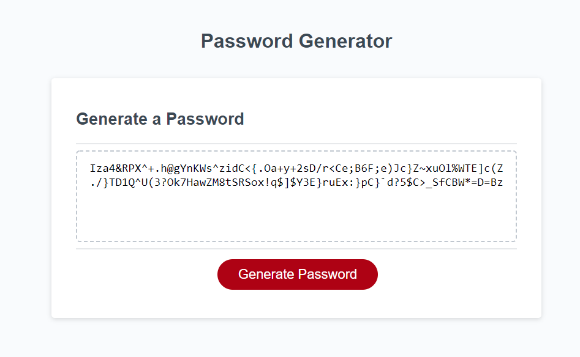

# Password Generator

## Purpose

This password generator will provide a comprehensive password for increased security.

## Usage

It will generate a password through a series of prompts:
- You will need to select a password length first
- You will then need to select whether or not to include numbers, letters, and symbols
- The password will then display on the screen, available to copy.

## App

Check it out in action [here](https://indy6678.github.io/not-the-mama/)!

## Credits

- [OWASP](https://owasp.org/)
- [Programiz](https://www.programiz.com/)
